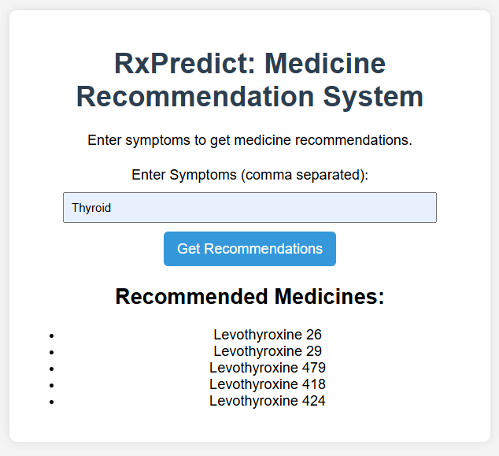

# RxPredict: Medicine Recommendation System

RxPredict is a machine learning-based recommendation system designed to suggest medicines based on symptoms entered by the user. The system leverages Natural Language Processing (NLP) and Collaborative Filtering techniques to provide relevant medicine recommendations.

## Project Structure

```
RxPredict/
│── data/
│   ├── medicines.csv
│   ├── patient_history.csv
│── models/
│   ├── medicine_recommendation.pkl
│── src/
│   ├── __init__.py
│   ├── data_preprocessing.py
│   ├── train_model.py
│   ├── recommend.py
│── templates/
│   ├── index.html
│── static/
│   ├── styles.css
│── app.py
│── requirements.txt
│── README.md
│── .gitignore
```

## Features
- Accepts symptoms as input.
- Recommends relevant medicines based on patient history and symptom matching.
- Simple web interface using Flask.
- Uses NLP for symptom analysis.

## Installation

1. Clone the repository:
   ```sh
   git clone https://github.com/your-username/RxPredict.git
   cd RxPredict
   ```
2. Create a virtual environment:
   ```sh
   conda create -p venv python==3.8 -y
   ```
3. Activate the virtual environment:
   ```sh
   conda activate venv
   ```
4. Install dependencies:
   ```sh
   pip install -r requirements.txt
   ```

## Usage

1. Run the Flask application:
   ```sh
   python app.py
   ```
2. Open your browser and navigate to `http://127.0.0.1:5000`.
3. Enter symptoms in the input field (comma-separated).
4. Click on "Get Recommendations".
5. View the recommended medicines.

## Below is a preview of the web application:



## Future Enhancements

1. Integration with EHR (Electronic Health Records): Enhancing recommendations using real patient data.
2. Personalized Medicine Recommendations: Adapting suggestions based on user history and preferences.
3. Mobile Application Support: Creating an Android/iOS app for easier access.

### Developed By
Mansi Sawant - [LinkedIn](https://www.linkedin.com/in/s-mansi/)  

---

###  Contributions
Feel free to fork this repository and contribute by submitting a pull request! 😊


